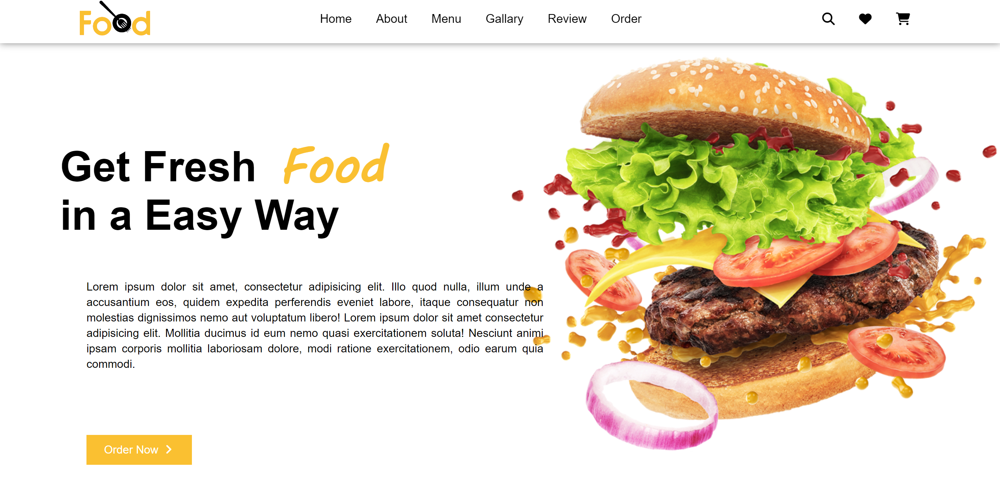
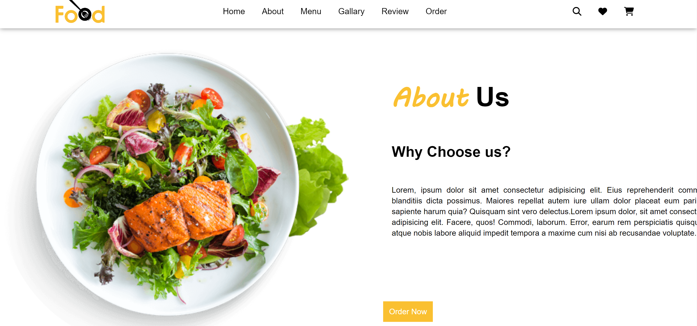
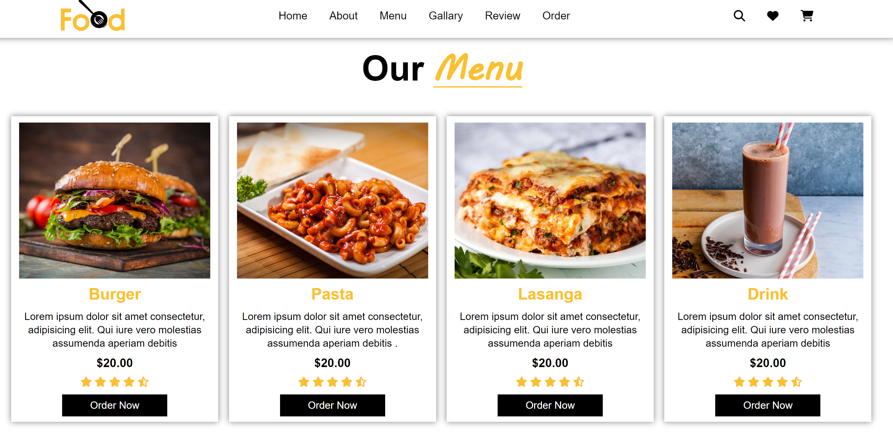
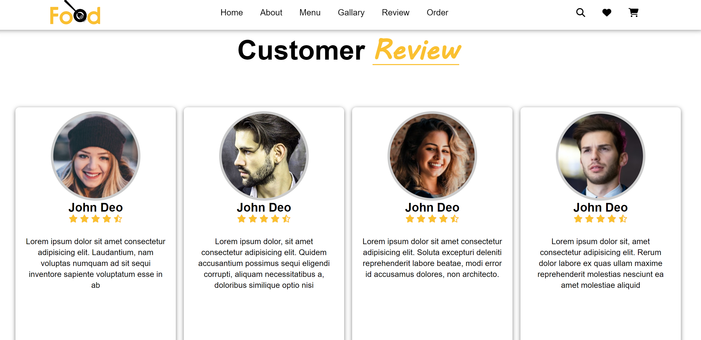
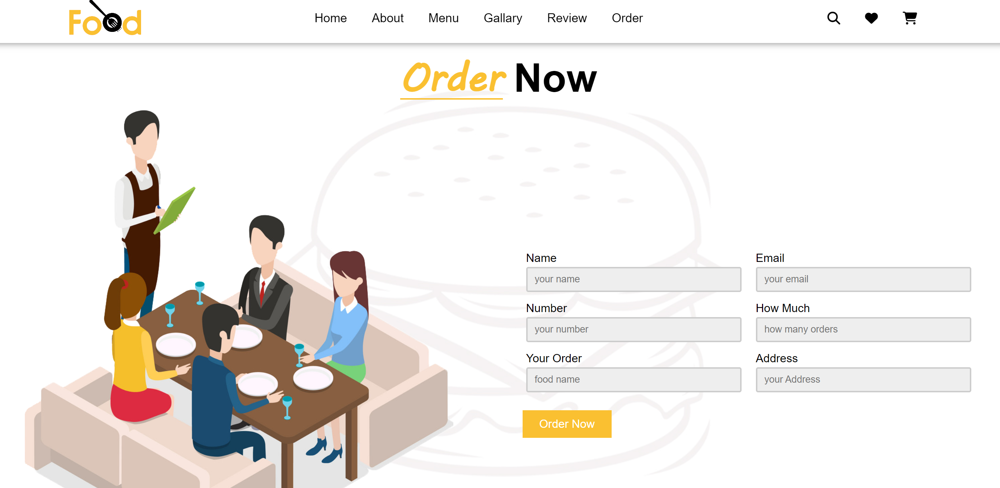
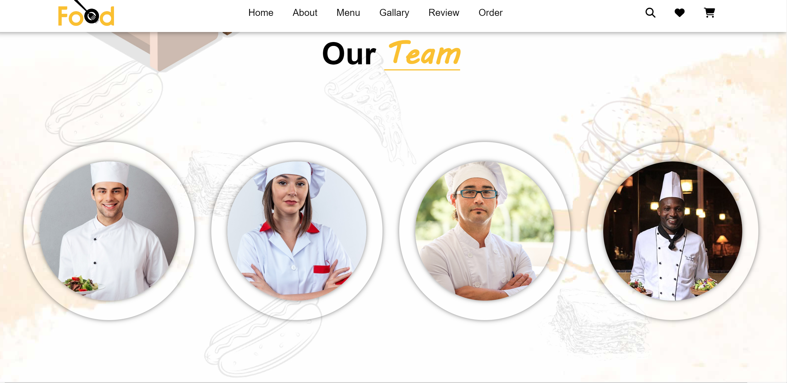

# Food-Website
This project is a static website for a food service, designed using **HTML** and **CSS**. It consists of several sections aimed at providing information and functionality related to food offerings.

## Technologies Used
- HTML
- CSS

## Sections

- **Home**: Introduction to the website with links to other sections.
- **About**: Information about the food service, its mission, and values.
- **Menu**: Display of available dishes categorized into  main courses, desserts, and beverages.
- **Gallery**: Visual showcase of the dishes served.
- **Reviews**: Customer feedback and testimonials.
- **Order**: Online ordering system for food delivery.

## Installation
- **Clone** the **repository** and open **index.html** in a web browser to view the website.

## Usage
Navigate through the sections using the **navigation bar** at the top of each page. Click on the links to visit different sections (Home, About, Menu, Gallery, Reviews, Order).

## Application Snapshots

